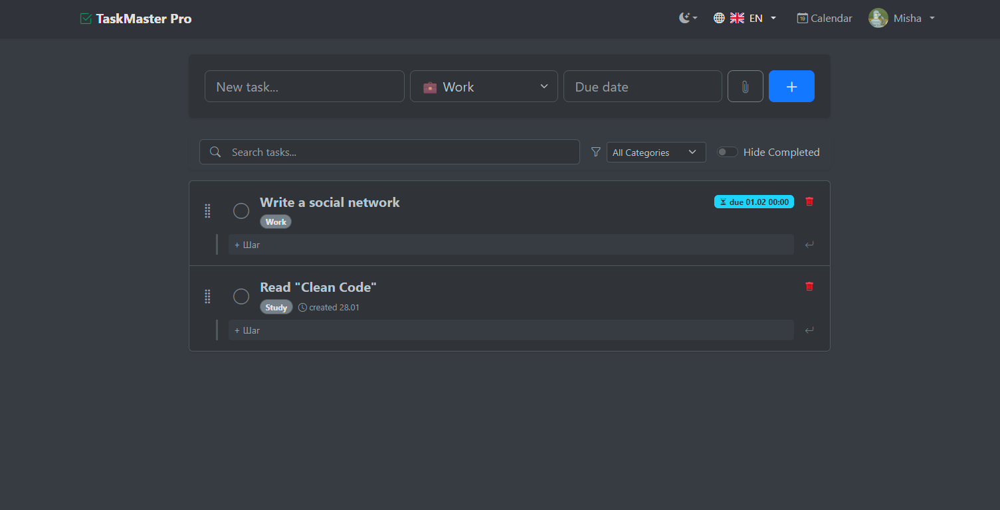
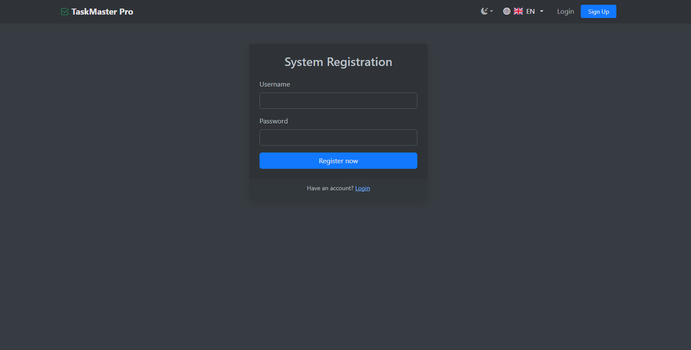

# 🚀 TaskMaster Pro


**TaskMaster Pro** — это современный веб-менеджер задач с поддержкой категорий, подзадач, вложений и интерактивного
календаря. Приложение разработано на **Flask**, использует **PostgreSQL** для хранения данных и полностью упаковано в *
*Docker**.

> 💡 **Демо:** [Ссылка на деплой (если есть)] | **Статус:** Stable

## 🖼️ Скриншоты

### 📊 Главная панель


### 📅 Календарь


### 🔐 Экран регистрации

## ✨ Функциональность

- ✅ **CRUD Задач:** Полный цикл управления задачами (создание, чтение, обновление, удаление).
- 📂 **Категории:** Цветовая маркировка (Работа, Дом, Учеба, Покупки и др.).
- 📅 **Интерактивный календарь:** Визуализация дедлайнов (FullCalendar).
- 📎 **Вложения:** Загрузка файлов и изображений к задачам.
- 🏗️ **Подзадачи:** Разбиение сложных задач на мелкие этапы с прогресс-баром.
- 👤 **Личный кабинет:** Смена аватара, имени и пароля.
- 🌐 **Локализация:** Поддержка русского и английского языков.
- 🐳 **Docker:** Развертывание одной командой.

## 🛠️ Технический стек

* **Backend:** Python 3.9, Flask, SQLAlchemy, Flask-Login, Flask-Migrate.
* **Database:** PostgreSQL (Prod), SQLite (Test/Dev).
* **Frontend:** Bootstrap 5, Jinja2, JavaScript (Fetch API).
* **Testing:** Pytest, Coverage (Покрытие тестами 77%).
* **DevOps:** Docker, Docker Compose, GitHub Actions.

## 🚀 Запуск проекта (Docker)

Это рекомендуемый способ запуска. Вам понадобятся установленные **Docker** и **Docker Compose**.

### 1. Клонирование репозитория
```bash
git clone [https://github.com/KoshFromVorlon/flask_pro_taskmanager.git](https://github.com/KoshFromVorlon/flask_pro_taskmanager.git)
cd flask_pro_taskmanager
```

Запуск контейнеров:
```bash
docker-compose up --build
```
Применение миграций:
```bash
docker-compose exec web flask db upgrade
```

Запуск тестов внутри контейнера:
```bash
docker-compose exec web coverage run -m pytest
```

Просмотр отчета о покрытии (Coverage Report):
```bash
docker-compose exec web coverage report
```

## 📂 Структура проекта:
```text
flask_pro_taskmanager/
├── .github/
│   └── workflows/
│       └── tests.yml    # Конфигурация CI/CD (GitHub Actions)
├── app/
│   ├── static/
│   │   ├── avatars/     # Загруженные аватарки пользователей
│   │   ├── uploads/     # Файлы, прикрепленные к задачам
│   │   ├── script.js    # Логика Drag-and-Drop и календаря
│   │   └── style.css    # Стили оформления
│   ├── templates/
│   │   ├── admin/       # Шаблоны админ-панели
│   │   ├── base.html    # Базовый макет (навбар, футер)
│   │   ├── calendar.html
│   │   ├── index.html   # Главная страница (список задач)
│   │   ├── login.html
│   │   ├── profile.html
│   │   └── register.html
│   ├── __init__.py      # Инициализация приложения (App Factory)
│   ├── models.py        # Модели БД (User, Task, Subtask, Attachment)
│   ├── routes.py        # Основная логика и маршруты
│   └── translations.py  # Словарь для мультиязычности (RU/EN)
├── migrations/          # Версии миграций базы данных (Alembic)
├── tests/               # Пакет тестов (Pytest)
│   ├── conftest.py      # Фикстуры и настройка тестовой БД
│   ├── test_api.py      # Тесты API календаря
│   ├── test_extended.py # Тесты профиля и редких кейсов
│   ├── test_models.py   # Тесты моделей данных
│   ├── test_routes.py   # Тесты основных страниц
│   ├── test_security.py # Тесты прав доступа
│   └── test_tasks.py    # Тесты логики задач
├── .dockerignore        # Исключения для Docker-сборки
├── config.py            # Конфигурация переменных окружения
├── Dockerfile           # Инструкция сборки контейнера приложения
├── docker-compose.yml   # Оркестрация сервисов (Web + Postgres)
├── LICENSE              # Лицензия MIT
├── requirements.txt     # Список зависимостей Python
└── run.py               # Точка входа в приложение
```
